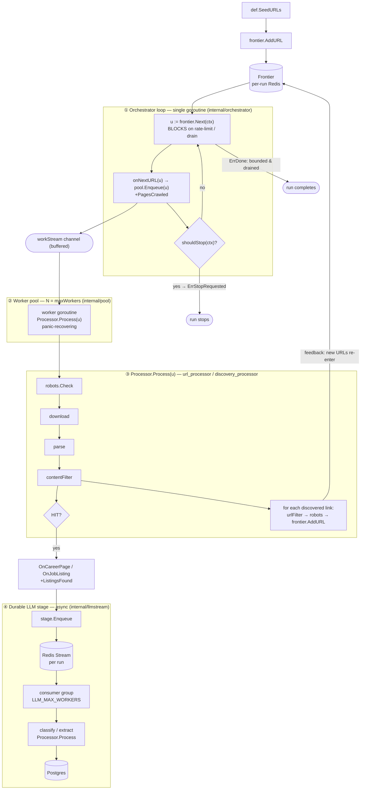

# The crawl loop

There are two crawl **kinds** — `discovery` and `keyword` — but they share **one
loop engine**: an orchestrator loop, a worker pool, and a processor. The kind
only changes which processor is wired in, which frontier mode is used, and where
the "hits" go. Everything below is per-run: each run has its own frontier
namespace, worker pools, and counters (see `internal/runner`).

## The engine

## How the parts fit

1. **Orchestrator loop** (`internal/orchestrator`) — the only control loop, a
   single goroutine that does no I/O of its own. It polls `shouldStop`, blocks on
   `frontier.Next`, and hands each URL to the pool via `onNextURL`. It ends on
   `ErrDone` (bounded frontier drained) or `ErrStopRequested` (desired-state stop).
2. **Worker pool** (`internal/pool`) — `maxWorkers` goroutines ranging over a
   buffered channel, each running `Processor.Process`. A panic in one item is
   recovered and logged so it can't crash the pool.
3. **Processor** (`url_processor` / `discovery_processor`) — `robots.Check →
   download → parse → contentFilter`, then two things: decide whether the page is
   a **hit** (forward it to the LLM stage) and **discover links** (filter + robots,
   then `frontier.AddURL`). A deferred `MarkDone` releases the URL's in-flight
   lease so the frontier can tell when it has truly drained.
4. **Durable LLM stage** (`internal/llmstream`) — a hit is XADD'd onto a per-run
   Redis Stream and drained by a consumer group, so the crawl never blocks on the
   model and a crash/restart redelivers rather than loses the candidate
   (ADR-0007). The producer pool is closed *before* the stage so nothing is
   enqueued mid-drain.

The cycle that keeps a crawl moving isn't in the orchestrator — it's the
**feedback loop**: each processed page discovers links, `AddURL` feeds them back
into the frontier, and `Next` pulls them at the top of the loop.

## Same engine, two wirings

| | **Discovery crawl** | **Keyword crawl** |
|---|---|---|
| Seeds | `def.SeedURLs` | Catalog career-page URLs |
| Frontier mode | **Perpetual** | **Bounded** |
| Processor | `discovery_processor` | `url_processor` |
| "Hit" decision | `pagegate.CareerPage` gate | keyword relevance filter |
| LLM stage | classify → Company + CareerPage | extract → JobListing |
| **Ends when** | only a desired-state **stop** | frontier drains → `ErrDone` |

The frontier **mode** (`internal/frontier`) is the whole difference in loop
lifetime. **Bounded**: `Next` returns `ErrDone` once every queue is empty *and*
no lease is in-flight, so the loop returns `nil` and the run completes.
**Perpetual**: `Next` never returns `ErrDone` — it blocks waiting for URLs that
may be added later, so a discovery run ends only when `runner.supervise` observes
a `stopping` status and cancels the context. That desired-state watcher exists
precisely because a parked perpetual loop, blocked in `Next`, can't observe a
stop on its own.
