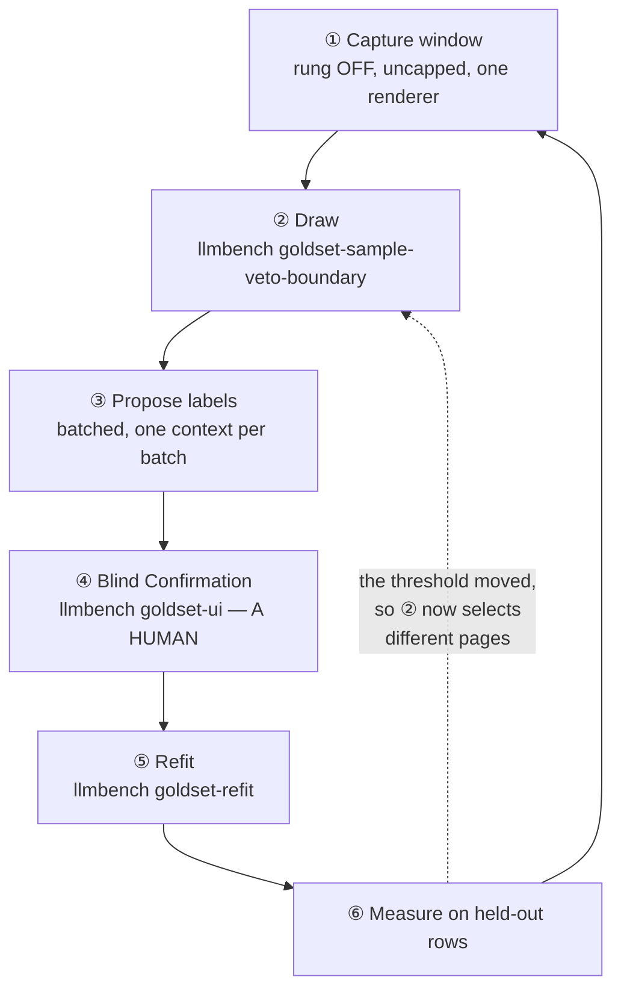

# Improving the Posting Score

The **Posting Score** is the only rule in `internal/pagegate` that is fitted rather than argued
(ADR-0049). Every other list there is a human decision you improve by thinking harder; this one you
improve by *feeding it*. That makes it the only part of the Extract Gate with a maintenance loop,
and the loop has a specific failure mode that this document exists to keep you out of.

Read `README.md` → *"Turning the Learned Veto on (ADR-0049)"* for how to **switch the rung on**.
This is the other question: once it is on, how do you make it **better**.

## The loop

That dotted edge is the whole problem. A draw selects pages by where the **current** threshold sits.
Refit and the threshold moves, so the next draw asks a different question. Go round twice without a
human at ④ and the model is choosing its own training set from its own beliefs — the same shape as
the extractor-verdict trap ADR-0049 documents, one level up: there the *labels* came from a model,
here the *sampling frame* does.

## What actually improves it

In rough order of value per unit of effort.

### 1. Confirmed labels, not more labels

ADR-0049's founding measurement is that label **quality**, not volume, is the binding constraint:
training on 12,152 extractor verdicts scored 0.617 where 442 human labels scored 0.836. A proposer
is much better than the extractor's verdict, but an unconfirmed proposal is still a machine label.
`pendingVetoBoundaryConfirmations` exists to make that debt visible, and `goldset-refit` refuses to
let it rise silently.

Confirming rows you already hold beats drawing new ones, and it also tells you *how good the
proposer is* — which every later shortcut depends on.

### 2. Rows the model gets wrong, not rows it gets right

A uniform draw over the drop set is mostly pages the score already rates near zero. In the pass
recorded below, **113 of 150** sampled dropped pages were plain `residue`. They confirm what the
model knows and move a weight vector almost not at all.

The rows that teach are the misclassified ones: real Job Listings scoring low, and hubs or residue
scoring high. `-accepted-rows` / `-near-rows` / `-deep-rows` exist so a draw can be pointed at them
rather than spread evenly. Point them at the failure mode you actually observed.

### 3. New hosts, not just new rows

Cross-validation is host-grouped and the leakage guard is keyed on host words, so both read
**hosts**, not rows. A thousand rows from twenty hosts buy far less than two hundred from two
hundred. A capture window over a different slice of the Catalog adds distribution; a deeper crawl of
the same hosts mostly adds depth, and deep pages are systematically unlike the ones near a Career
Page root.

### 4. More rows, while the fit is still overparameterised

This one is real and measurable. The artifact carries **517 weighted entries** (500 Score Vocabulary
words + 17 structural Score Signals). Against that:

| Extract Gold Set | scorable rows | hosts | mean log-loss |
|---|---:|---:|---:|
| 457 rows | 442 | 357 | 0.0247 |
| 737 rows | 692 | 516 | 0.0421 |

Log-loss rising is the *good* direction: at 442 rows against 517 weights the model could largely
memorise its training set, and it did. More rows pushed it toward generalising, and the calibration
followed — see below. Until rows comfortably exceed weights, volume still buys something. It buys
less than ①–③, and it buys nothing at all if the labels are weak.

## What the loop has produced so far

The one full turn on record, for calibration of expectations rather than as a target.

**Before** (457 rows): `VetoThreshold` 0.605395. In-sample Veto Depth 50 of 177 scorable rung-8
accepts (28.2%). Measured over a real capture frame of 18,233 pages, the same weights vetoed 66% —
**more than twice the in-sample figure**. The fit was not conservative, it was mis-calibrated on too
narrow a population.

**After** (737 rows): `VetoThreshold` 0.165048. In-sample Veto Depth 240 of 427 scorable accepts
(56.21%) at zero `detail` lost. Over the same capture frame it drops **57.3%**, and live it ran at
52.3%. In-sample and stream agree for the first time.

**Held out** — 300 pages from that frame that no drawing had selected, labelled independently:

| | |
|---|---:|
| Extract calls cut | 57.3% |
| Recall of real Job Listings | 95.7% (95% range 91.4–99.8) |
| Precision of what it keeps | 80.7%, against a 36.0% baseline |

Note this is **not** the out-of-fold figure, which at the same operating point reads 27 of 180
`detail` lost (15%). Both are honest; they describe different populations. Out-of-fold is measured
over the Extract Gold Set's rung-8 accepts, which are deliberately Boundary-Stratum-heavy — a hard
population, as ADR-0049 says of itself. The held-out frame is the stream. **For "what happens if I
turn this on", quote the stream; for "how fragile is this fit", quote out-of-fold.** Never quote
either without saying which.

## The hazards

**Circular selection.** Never let two consecutive refits draw their training data from a threshold
the previous refit chose, with no human confirmation in between. If you must iterate quickly, keep
the *frame* fixed and vary only what you sample from it — the frame is then an outside fact rather
than the model's opinion.

**Machine labels compounding.** Every unconfirmed row makes the shipped gate more a product of a
model and less of the record. Watch `pendingVetoBoundaryConfirmations`: it is the count of rows the
gate is fitted on that nobody has read.

**Grading a model with itself.** A proposer that also trained the weights cannot detect an error it
makes consistently in both roles. A held-out test scored by the same model measures *generalisation*
and says nothing about *correctness*. Only Blind Confirmation measures correctness.

**Spending the held-out set.** The rows you keep out of the fit are the only way to answer "did this
get better". Fold them all in and the next improvement is unmeasurable. Keep a reserve, and say in
the commit which rows it is.

**Forgetting that the threshold moves.** It is generated beside the weights and re-chosen by every
refit under the zero-`detail`-loss constraint. Anything that hardcodes it — a dashboard line, a
runbook sentence, a test fixture — is wrong the moment the Gold Set grows. Prefer reading
`pagegate.VetoThreshold`, or a metric exported from it, over writing the number down. Since
#304 that metric exists: `crawler_llm_veto_threshold`, set once at start-up from
`pagegate.VetoThreshold`, is what the LLM dashboard's cut line is drawn from.

## A turn of the loop, concretely

1. **Capture** with `EXTRACT_LEARNED_VETO=false` and `EXTRACT_CAPTURE_MAX=0`, to a **new** file.
   The tap sits downstream of the gate, so with the rung on the pages it withholds are never
   recorded and the frame's own denominator is missing. Note the start time — the drawing verbs
   take it as `-since` and cannot reconstruct it. One window, one renderer: a crawl with
   `PARSE_STRUCTURAL_RENDERING` flipped mid-window stamps rows a drawing must then discard
   (ADR-0046).
2. **Stop on breadth, not completion.** A full Collection Cycle is many hours, most of it crawling
   deeper into hosts already sampled. Host coverage is what makes a frame representative; when new
   hosts stop arriving, the window is done.
3. **Read the depth before drawing.** Report mode writes nothing and needs no labels. If the
   pre-registered floor fails, stop — no labelling effort is worth spending.
4. **Draw, pointed at the weakness.** Then **propose**, batched: one batch per context, results
   accumulating on disk. `cmd/llmbench/extract-goldset/README.md` carries the protocol and the
   rubric; never read a whole worksheet at once.
5. **Confirm blind.** A human, through `goldset-ui`, labelling before anything is revealed
   (ADR-0048). This is the step that cannot be delegated and the one everything else is worth
   nothing without.
6. **Refit** with `goldset-refit`. Expect it to refuse the first run after a drawing: the drawing
   raised a pending-confirmation count, and only a human may move that ratchet.
7. **Re-measure on rows the fit has never seen**, and record the result beside the operating point
   it describes.

## Related

- **ADR-0049** — why the rung is fitted, how the threshold is chosen, and the amendments recording
  each measurement as it was taken.
- **ADR-0043** — the Extract Gold Set, its drawings and their weights.
- **ADR-0048** — Blind Confirmation.
- **ADR-0044** — Positive Evidence, the argued rung this one prunes.
- `README.md` → *Turning the Learned Veto on* — the rollout runbook.
- `cmd/llmbench/extract-goldset/README.md` — the labelling protocol and the drawings' arithmetic.
